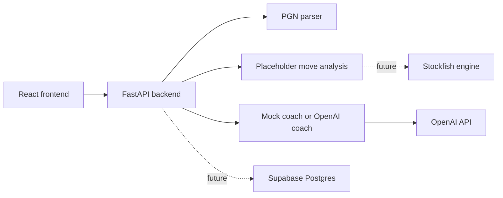

# Architecture Notes

The frontend calls the FastAPI backend only. It never sends requests to OpenAI and never stores API keys. The backend chooses mock coaching when `USE_MOCK_AI=true` or when `OPENAI_API_KEY` is missing.

Phase 1 keeps database and engine integrations optional. The app runs locally with mock coaching and parsed PGN data.
